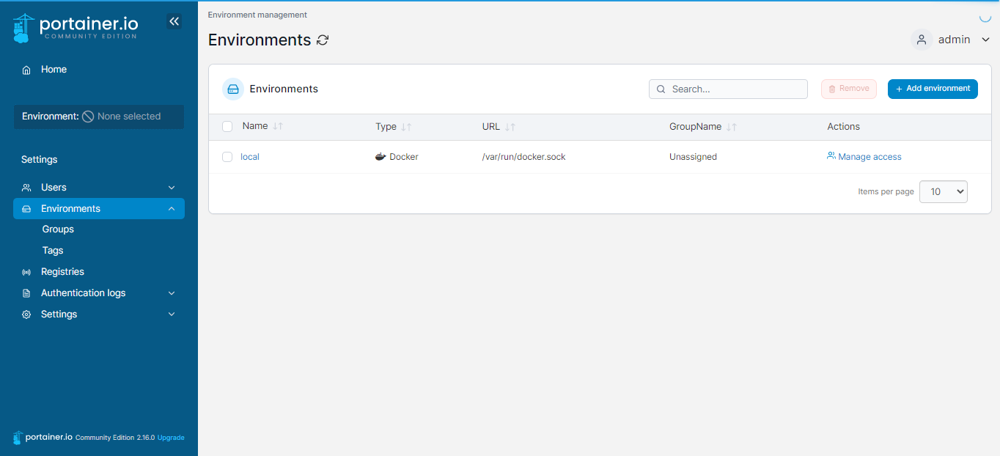
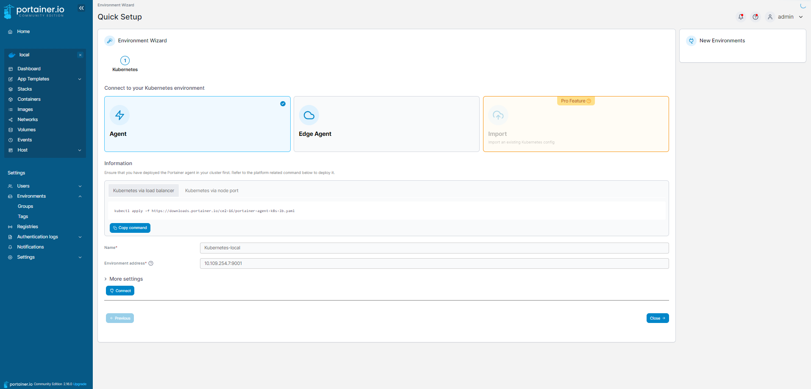

# Portainer
You can run the following commands to start a portainer instance
```sh
# Get latest image version
docker image pull portainer/portainer-ce:latest
# Create portainer volume
docker volume create portainer_data
# Run container
docker run -d -p 8000:8000 -p 9000:9000 --name=portainer --restart=always -v /var/run/docker.sock:/var/run/docker.sock -v portainer_data:/data portainer/portainer-ce:latest -H unix:///var/run/docker.sock --admin-password="adminadmin123"
# Stop portainer
docker volume rm portainer_data
docker stop portainer
docker rm portainer
```

## Portainer agents
### Docker agent
You can add a docker agent by starting this container on the node you want to add **make sure connection is established between host and remote machine**! also the agent and host must have same versions or you ll face some issues:
```sh
docker run -d   -p 9001:9001   --name portainer_agent   --restart=always   -v /var/run/docker.sock:/var/run/docker.sock   -v /var/lib/docker/volumes:/var/lib/docker/volumes   portainer/agent:2.16.0
```

You can also attache another docker instance to your portainer through the docker daemon address usually with port x.x.x.x:2375
### Kubernetes agent
For a kubernetes agent we need:
```sh
# Deploy portainer agent
## Node Port (make sure to use localhost:<exposed port>)
kubectl apply -f https://downloads.portainer.io/ce2-16/portainer-agent-k8s-nodeport.yaml
# Get Ip and port of portainer agent to add
kubectl get svc -n portainer

NAME                               TYPE        CLUSTER-IP     EXTERNAL-IP   PORT(S)          AGE
service/portainer-agent            NodePort    10.109.254.7   <none>        9001:30778/TCP   67m
service/portainer-agent-headless   ClusterIP   None           <none>        <none>           67m


## LoadBalancer (make sure to use <service clusterip>:9001)
kubectl apply -f https://downloads.portainer.io/ce2-18/portainer-agent-k8s-lb.yaml

# Get Ip and port of portainer agent to add
kubectl get svc -n portainer
NAME                       TYPE           CLUSTER-IP       EXTERNAL-IP   PORT(S)          AGE
portainer-agent            LoadBalancer   10.111.230.246   localhost     9001:30778/TCP   6m26s
portainer-agent-headless   ClusterIP      None             <none>        <none>           6m26s
```
If With load 
You can now add the new kubernetes agent into portainer in this example the endpoint should be **10.109.254.7:9001**

**Add environment**



**Attache agent**


