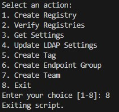
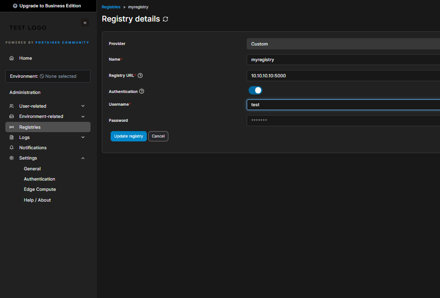
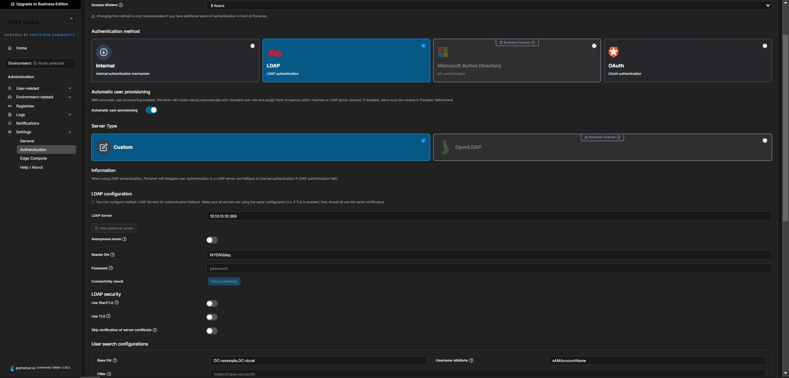
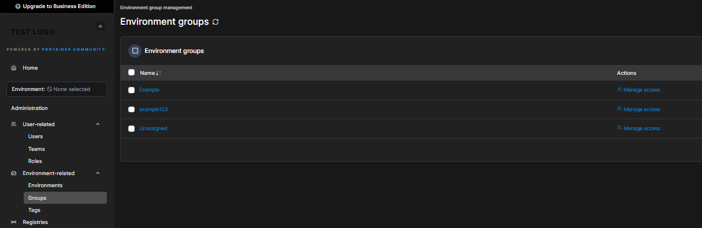
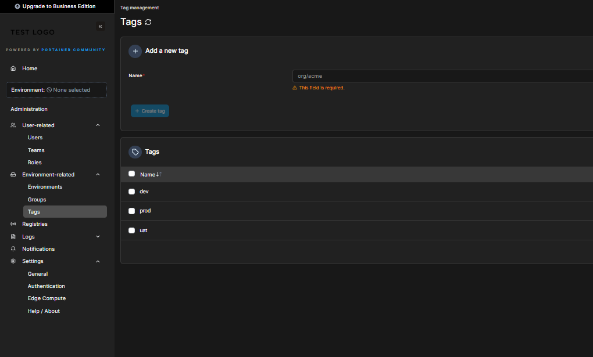
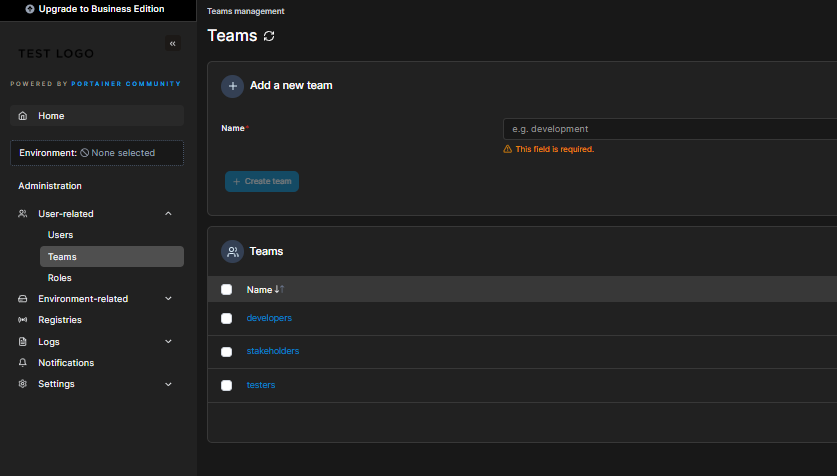

# Portainer
# Prerequisites
In order to run a portainer entreprise edition a Licence key is required, Make sure to pass it as environment variable in **.env** file with key **LICENSE**
## Portainer Default password 
Use the following command to generate a hash for the password:
### Using --admin-password
```sh
# Will be used for --admin-password=
docker run --rm --entrypoint="" httpd:2.4-alpine sh -c "htpasswd -nbB admin 'superpassword' | sed 's/\$/\$\$/g' | cut -d ':' -f2"
```
### Using --admin-password-file
```sh
# Linux
echo -n "adminadmin123" >password.txt
# Powershell
"adminadmin123" | Set-Content -Path "password.txt" -NoNewline
```
# Quick Start
## Installation
### Docker Compose
```sh
docker-compose up
```
### API Script
```sh
# API
docker run -it --rm --name portainer-api -v ${pwd}/API/:/app/ -w /app/ --network container:portainer alpine sh -c "apk add bash curl jq && ./api.sh"
```


### Add registry

### Add LDAP configuration



### Manage Environments
#### Groups

#### Tags

#### Teams


# Setup Agent
```sh
docker run -d -p 9001:9001   --name portainer_agent   --restart=always   -v /var/run/docker.sock:/var/run/docker.sock   -v /var/lib/docker/volumes:/var/lib/docker/volumes   portainer/agent:2.20.3-alpine
```
# Reference 
- [Portainer compose deployment with admin password preset](https://gist.github.com/deviantony/62c009b41bde5e078b1a7de9f11f5e55)
- [Portainer password issues (newline)](https://github.com/portainer/portainer/issues/2816)
- [Portainer API documentation](https://app.swaggerhub.com/apis/portainer/portainer-ee/2.19.5)