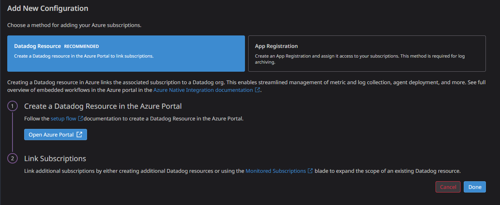

# Azure Datadog Integration
# Introduction
This mini project help us integrating azure with datadog for advanced cloud monitoring. In order to achieve this we are using terraform to make things simpler
# Prerequisites
* A datadog account
* Datadog **API KEY**
* Datadog **Application Key**
* An azure subscription
* Azure service account with the right role assignments
## Quick start
```sh
# Initialize terraform modules and providers
terraform init
# Apply resources
terraform apply 
```
Onca all resources are ready an url will be printed where datadog integration can be checked through a dashboard that has been created automatically.

# Information
Datadog azure integration could be achieved in 2 ways:
