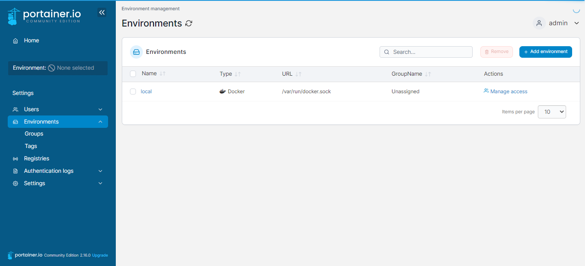
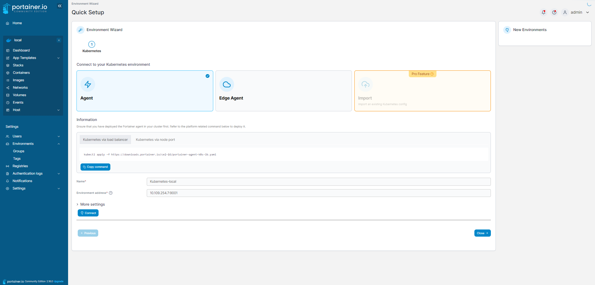

# Portainer
You can run the following commands to start a portainer instance
```sh
# Get latest image version
docker image pull portainer/portainer-ce:latest
# Create portainer volume
docker volume create portainer_data
# Run container
docker run -d -p 8000:8000 -p 9000:9000 --name=portainer --restart=always -v /var/run/docker.sock:/var/run/docker.sock -v portainer_data:/data portainer/portainer-ce:latest
# Stop portainer
docker volume rm portainer_data
docker stop portainer
docker rm portainer
```

## Portainer agent
For a kubernetes agent we need:
```sh
# Deploy portainer agent
kubectl apply -f https://downloads.portainer.io/ce2-16/portainer-agent-k8s-nodeport.yaml
# Get Ip and port of portainer agent to add
kubectl get svc -n portainer

NAME                               TYPE        CLUSTER-IP     EXTERNAL-IP   PORT(S)          AGE
service/portainer-agent            NodePort    10.109.254.7   <none>        9001:30778/TCP   67m
service/portainer-agent-headless   ClusterIP   None           <none>        <none>           67m
```
**Add environment**



**Attache agent**

