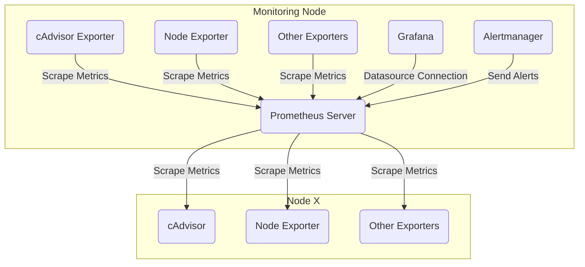
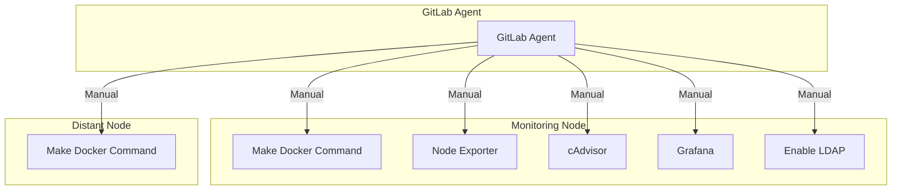

# Grafana/Prometheus Monitoring
This project sets up a monitoring stack using Prometheus, Alertmanager, Grafana, and various exporters. It monitors server health, Docker containers, and more.
# Overview
## Monitoring arch

## CI CD workflow

## Prerequisites
Ensure you have the following prerequisites installed:

- Docker
- Docker Compose
- Make

## Quick Start
Using make and docker you can initialize/clean the monitoring stack in seconds, and start monitoring with [grafana](http://localhost:3000).
```sh
# Get commands info
make help
# Init stack
make docker-init
# Cleanup stack
make docker-clean
```

## Stack
| Service Name           | Host:Docker Ports | Utility                                                                  | Configuration                                     | Image Version |
| ---------------------- | ----------------- | ------------------------------------------------------------------------ | ------------------------------------------------- | ------------- |
| alertmanager           | 6002:9093         | Manages and sends alerts for system monitoring.                          | [Alertmanager](#alertmanager)                     | v0.26.0       |
| karma                  | 6003:8080         | Provides a user interface for alert management and visualization.        | N/A                                               | v0.115        |
| blackbox-exporter      | N/A               | Probes external services and checks their availability and responses.    | [Blackbox Exporter](#blackbox-exporter)           | v0.10.0       |
| cadvisor               | 6001:8080         | Collects container metrics for resource usage analysis.                  | N/A                                               | v0.47.0       |
| grafana                | 3000:3000         | Offers a visualization and monitoring platform for various data sources. | [Grafana](#grafana)                               | 10.0.4        |
| node-exporter          | 6007:9100         | Collects system-level metrics from hosts for monitoring.                 | N/A                                               | v1.6.1        |
| awaragi mssql exporter | N/A               | Exports metrics from Microsoft SQL Server for monitoring.                | [AWARAGI MSSQL Exporter](#awaragi-mssql-exporter) | v1.3.0        |
| sql exporter           | N/A               | Build and Exports metrics from Microsoft SQL Server for monitoring.      | [SQL Exporter](#sql-exporter)                     | v1.3.0        |
| nginx                  | 7080:80           | Serves as a web server and reverse proxy for web applications.           | [Nginx](#nginx)                                   | alpine        |
| nginx-secure           | 6006:9100         | Secures the Nginx server with basic authentication.                      | [Nginx Secure](#nginx-secure)                     | alpine        |
| prometheus             | 6008:9090         | Collects and stores time-series data for monitoring and alerting.        | [Prometheus](#prometheus)                         | v2.46.0       |


# Configurations

## **Alertmanager**
The Alertmanager handles alerts sent by client applications such as the **Prometheus** server, you can get more info following the [official alrtmanager documentation](https://prometheus.io/docs/alerting/latest/alertmanager).
### Configuration Files
1. [alertmanager/config/config.yml](./alertmanager/config/config.yml) 
It configures alerts that will be sent to teams or email but we can include more options in the future. 

## **Blackbox Exporter**
Blackbox exporter allows probing (checks availability) of endpoints over HTTP, HTTPS, DNS, TCP, ICMP and gRPC. You can get more information from the [official blackbox github documentation](https://github.com/prometheus/blackbox_exporter)
### Configuration Files
1. [blackbox-exporter/config/config.yml](./blackbox-exporter/config/config.yml) 
Configures the communication between blackbox and prometheus to probe on specific endpoints here is an example you can include on your [prometheus config](./prometheus/config/prometheus.yml):
```yaml
# ...
scrape_configs:
  - job_name: 'blackbox'
    metrics_path: /probe
    params:
      module: [http_2xx]  # Look for a HTTP 200 response.
    static_configs:
      # You can put as many endpoints as you want to test here
      - targets:
        - https://www.endpoint1.com
        - https://www.endpoint2.com
        - https://www.endpoint3.com
        - https://www.endpoint4.com
    relabel_configs:
      - source_labels: [__address__]
        target_label: __param_target
      - source_labels: [__param_target]
        target_label: instance
      - target_label: __address__
      # Make sure this matches the service name
        replacement: "blackbox-exporter:9115"  # Blackbox exporter.
      - target_label: region
        replacement: "local"
# ...
```

## **Grafana**
Grafana fetches data using datasources to monitor them through dashboards and to automate the setup of both we can automate the provisioning of the **datasources** and **dashboards**. Read more from the [official Grafana documentation](https://grafana.com/tutorials/provision-dashboards-and-data-sources/#configuration-as-code)
### Configuration Files
1. [grafana/config/provisioning/datasources/datasource.yml](grafana/config/provisioning/datasources/datasource.yml)
This configuration allow us provision the creation of datasources on grafna startup and in this case we are provisioning **prometheus datasource** in particular, [here is the link for the example I followed to provision prometheus](https://grafana.com/docs/grafana/latest/datasources/prometheus/#provisioning-example).
2. [grafana/config/provisioning/dashboards/dashboard.yml](grafana/config/provisioning/dashboards/dashboard.yml)
here is an example I followed for the [dashboard provisioning](https://grafana.com/docs/grafana/latest/administration/provisioning/#dashboards):

```yaml
# ...
apiVersion: 1
providers:
- name: The name of the dashboards group
  folder: '<dashboard group name here>'
  type: file
  disableDeletion: false
  editable: true
  options:
    path: <Path of the dashboard in the grafana container>
# ...
```
3. [grafana/config/ldap.toml](grafana/config/ldap.toml)
This configuration allow us to configure active directory ldap connection and user/group management for grafana, as you can notice the **bind_password** value is passed through **LDAP_ADMIN_PASSWORD** variable which is passed from [docker-compose](grafana/docker/docker-compose.yaml).
4. [grafana/docker/.env](grafana/docker/.env)
this file is used to pass environment variables to [docker-compose.yaml file](grafana/docker/docker-compose.yaml) to configure grafana properly. here is an example:
```sh
# Generate Default admin password
make pwgen >./grafana/docker/.env KEY=GRAFANA_ADMIN_PASSWORD
# Enable LDAP and pass ldap admin password through env vars
make docker-grafana-enable-ldap LDAP_ADMIN_PASSWORD='pa$sword'
```
## **SQL Exporter**
This exporter is used to help us create custom sqlserver metrics and export them to prometheus to better monitor our instances. You can find more in the [official mssql documentation](https://github.com/burningalchemist/sql_exporter#readme).
### Configuration Files
1. [sql-exporter/docker/docker-compose.yaml](sql-exporter/docker/docker-compose.yaml)
To configure an exporter you simply need to add this block with the right database credentials:
```yaml
  SERVER_INSTANCE_NAME:
    build:
      context: ..
      dockerfile: ./docker/Dockerfile  
    image: local/sql-exporter
    container_name: SERVER_INSTANCE_NAME
    # ports:
    #   - 9399:9399
    restart: always
    command:
      - "-config.data-source-name=sqlserver://${MSSQL_USER}:${MSSQL_PASS}@${MSSQL_HOST}:${MSSQL_PORT}" 
    networks:
      - monitoring
```
2. [sql-exporter/config/sql_exporter.yml](sql-exporter/config/sql_exporter.yml) this is the main config file and the most important part of it is `collector_files`, `collectors` which allow us to configure metrics that will be collected from our sqlserver. 
## **AWARAGI MSSQL Exporter**
This exporter is used to export few sqlserver metrics that can help us monitor our sqlserver instances. You can find more in the [official awaragi mssql documentation](https://github.com/awaragi/prometheus-mssql-exporter).
### Configuration Files
1. [mssql-exporter/docker/docker-compose.yaml](mssql-exporter/docker/docker-compose.yaml)
To configure an exporter you simply need to add this block with the right database credentials:
```yaml
  SERVER_INSTANCE_NAME:
    image: awaragi/prometheus-mssql-exporter:v1.3.0
    container_name: SERVER_INSTANCE_NAME
    # ports:
    #   - 4000:4000
    restart: always
    environment:
      - SERVER=SERVER_HOST
      - USERNAME=SERVER_USER
      - PASSWORD=SERVER_PASS
      # app,metrics,db,queries
      - DEBUG=app
    networks:
      - monitoring
```
## **Nginx**
Nginx here is just used to demonstrate how we can implement nginx monitoring. You can read more in the [stub nginx docs](http://nginx.org/en/docs/http/ngx_http_stub_status_module.html).
### Configuration Files
1. [nginx/config/default.conf](nginx/config/default.conf)
In this config we have this block that enables metrics at /metrics path
```conf
    location /metrics {
        stub_status on;
    }
```
And to fetch those metrics we have to configure our prometheus configuration like this:
```yaml
#...
scrape_configs:
  - job_name: 'nginx'
    scrape_interval: 5s
    static_configs:
      - targets: 
        - nginx-exporter:9113
#...
```
## **Nginx Secure**
Sometimes we need to deploy some exporters on distant nodes and ensure a secure connection that's why we are adding the nginx layer to enable basic authentication (make sure to remove the port mapping from the docker compose of the service you want to secure or this will be useless).
### Configuration Files
1. [nginx-secure/config/.htpasswd](nginx-secure/config/.htpasswd)
this is the file that will be used containing the basic user and to generate it you can run the following command:
```sh
make httpd password=your_admin_password >nginx-secure/config/.htpasswd
```
1. [nginx-secure/config/default.conf](nginx-secure/config/default.conf)
This is the nginx config that will be implemented to use the htpasswd generated on step **1.** :
```conf
server {
    listen       9100;
    listen  [::]:9100;
    server_name  localhost;
    location / {
        proxy_pass http://node-exporter:9100/ ;
        # User:admin | Password:00000000
        auth_basic           "Administrator’s Area";
        auth_basic_user_file /etc/nginx/.htpasswd;   
    }
}
```
In this example we are exposing node-exporter metrics but using basic auth so to fetch it through  promethus you will need to include this:
```yaml
# ...
    - targets: ['192.168.1.x:7081']
      labels:
        instance: 'remote'
    basic_auth:
      username: "admin"
      # The passwd file content should match the basic auth password used in nginx (htpasswd)
      password_file: /etc/prometheus/passwd
# ...
```
## **Prometheus**
Prometheus is the core of this monitoring solution, where it scraps all metrics from several exporters. To understand more about configuring it you can check out the [official documentation](https://prometheus.io/docs/prometheus/latest/configuration/configuration/).
### Configuration Files
1. [prometheus/config/prometheus.yml](prometheus/config/prometheus.yml) 
this contains the scrapping config of several exporters through seperate jobs, here is an example:
```yaml
global:
  scrape_interval: 15s

scrape_configs:
  - job_name: 'YOUR_JOB_NAME'
    static_configs:
      - targets: 
        - EXPORTER_IP:EXPORTER_PORT
```
2. [prometheus/config/alert-rules.yml](prometheus/config/alert-rules.yml)
The following is the configuration file for configuring alerts through specific alert rules depending on the metrics scrapped, this is the [official docs](https://prometheus.io/docs/prometheus/latest/configuration/alerting_rules/).
3. [prometheus/docker/docker-compose.yaml](prometheus/docker/docker-compose.yaml)
Using docker we are passig specific configurations through init commands like this for retention, config path and more:
```yaml
# ...
    command:
      - --config.file=/etc/prometheus/prometheus.yml
      - --storage.tsdb.retention.time=5d
      - --storage.tsdb.retention.size=2GB
# ...
```
4. [prometheus/config/web.yml](prometheus/config/web.yml)
This file is used to to enable basic authentication to prometheus. in order to enable it we have to specify the file path of the web.yml like this:
```yaml
# ...
    command:
      - --web.config.file=/etc/prometheus/web.yml
# ...
```
Then we will need to use bcrypt to generate a user/password in this example the config look like this
```yaml
# Bcrypt generator https://bcrypt-generator.com/
basic_auth_users:
    # value: azerty123
    admin: $2a$12$pLvlyRM3QJlItYF1oSLF5ei28.kbpT5Isnvr8VIdoQmstZfeK667W

```
# CI/CD
This CI/CD pipeline automates deployment by allowing gitlab agent to clone this repo zip its code, copy it into a target vm then running make commands to initialize and configure the stack or exporters.
## Workflow
  - Zip and send code to a target VM via SSH.
  - Initialize and configure the stack on the VM.
  - Optionally, deploy specific exporters for data collection.
## Usage
  - Set pipeline variables.
  - Push code changes to trigger the pipeline.
  - Optionally, deploy exporters for data collection.
## Variables
### Pipeline Variables
- `USER`: Host ssh username.
- `HOST`: Host ssh IP or dns.
### Repo Variables
  - `ADMIN_PASSWORD`: LDAP admin password.
  - `SSH_PRIVATE_KEY`: Private key used to ssh.
  - `SSH_PUBLIC_KEY`: Copy past it into the target vm for the right users' .ssh/authorized_keys for passwordless auth.
 
# Additional Information
- Special characters on make docker-grafana-enable-ldap:
```sh
make docker-grafana-enable-ldap LDAP_ADMIN_PASSWORD='pa$sword'
```
If you have special characters make sure to escape them for example pa$$sword -> pa$sword

- You can include or ignore running dotenv on a specific module like this :
```sh
# Disable dotenv
make DISABLE_DOTENV docker-run grafana
# Enable dotenv
make docker-run grafana
```
# Miscellaneous
- You can Run misc apps like this:
```sh
make docker-run misc/sqlserver
```

- cadvisor not starting [Failed to start manager: inotify_add_watch /sys/fs/cgroup/perf_event: no space left on device](https://github.com/google/cadvisor/issues/1581#issuecomment-367616070)
You can fix by running this command:
```sh
# Get current value (default is 8192)
cat /proc/sys/fs/inotify/max_user_watches  
# increase to 524288
sudo sysctl fs.inotify.max_user_watches=524288 
```
  

